# Ubuntu虚拟机安装

## 一、VM下安装ubuntu16.04

打开VMware Workstation，点击创建新的虚拟机

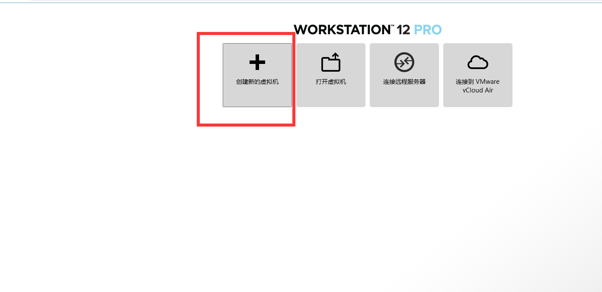

选择自定义，点下一步，如下图所示：

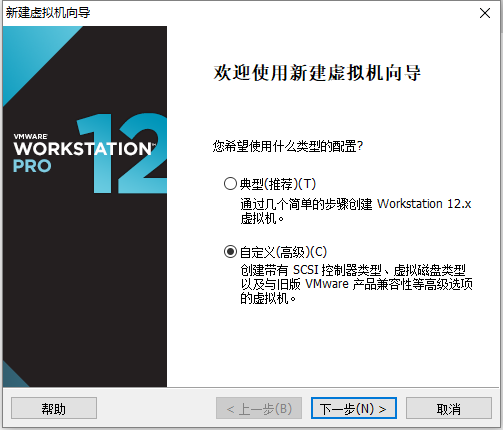

点下一步，如下图所示,这一步可以设置虚拟机的兼容性可以很好的设置向下兼容：

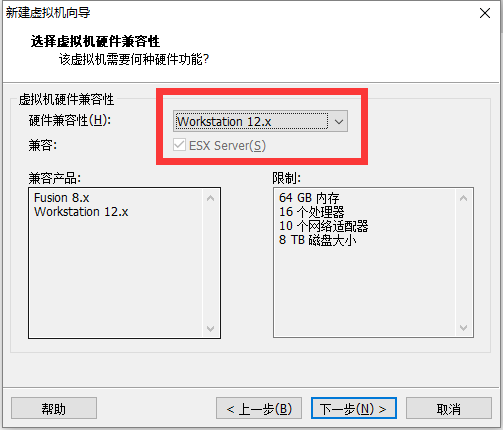

选择**安装程序光盘文件**，如下图所示：

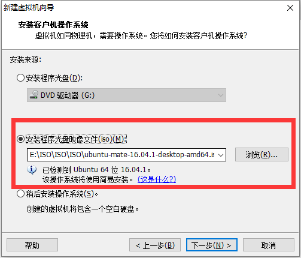

新建虚拟机向导并设置用户名密码：

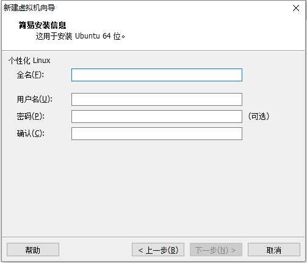

命名虚拟机：

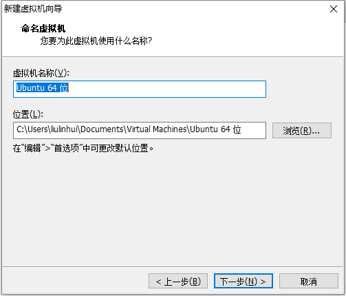

配置处理器：

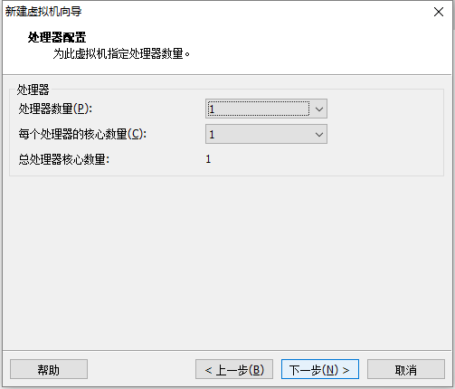

配置内存:

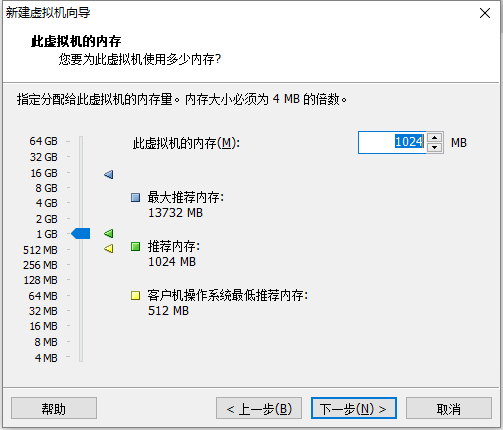

设置网络为NAT模式（经过测试直连账号NAT和桥接模式虚拟机都可以联网）:

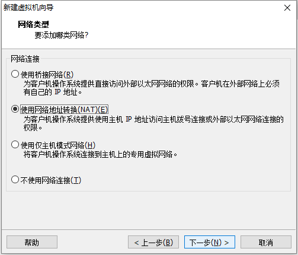

选择I/O控制器类型：

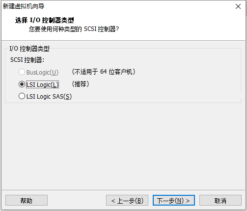

选择磁盘类型：

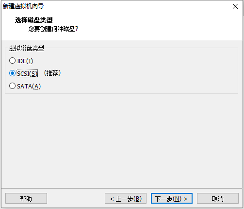

创建新磁盘：

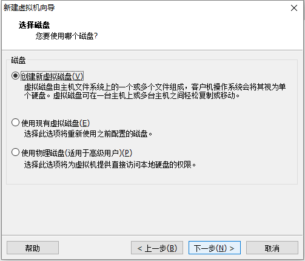

制定磁盘容量（这里最好设置的大一点，以后扩容比较麻烦）:

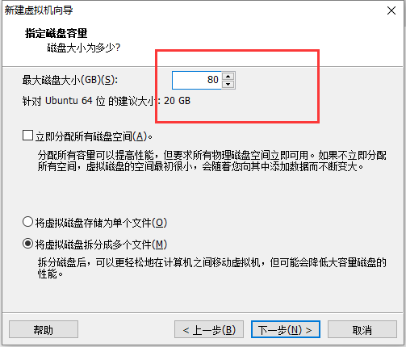

创建虚拟机:

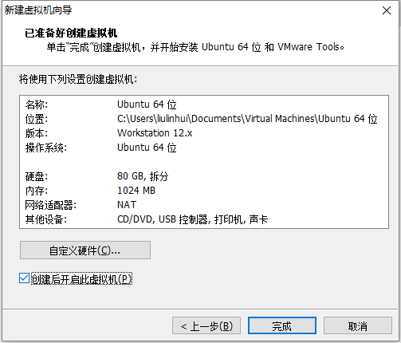

之后就会自动安装了，安装过程中可能遇到一些包下载过慢，如果实在等不得就点击skip跳过，等装好进虚拟机里面更新：

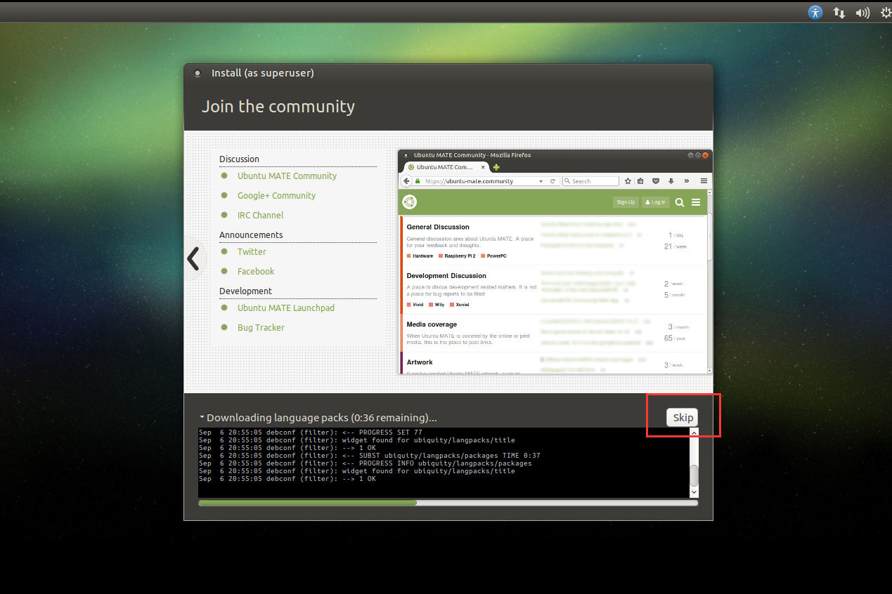

### 优化：
虚拟机用了一段时间以后会变得比较卡这时候可以i通过磁盘清理一下，如下图所示：

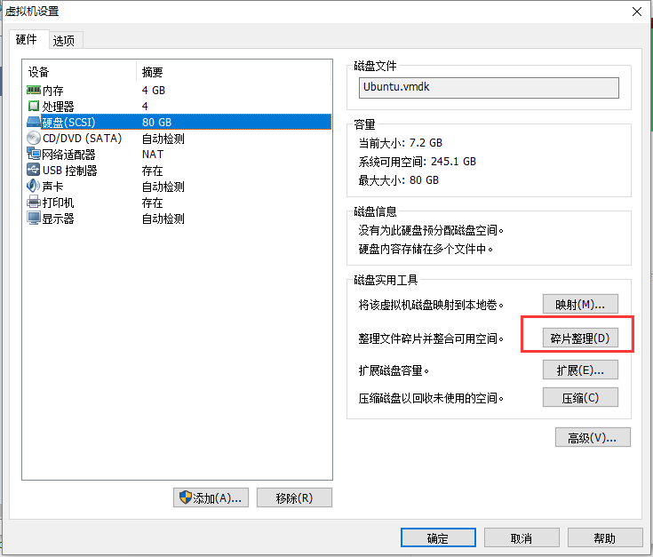

## 二、安装后基本配置

### 1.更换国内源

选择软件更新：

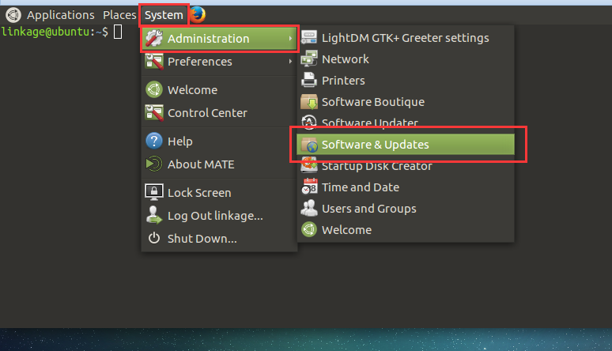

这里进去测速后选择最快的源：

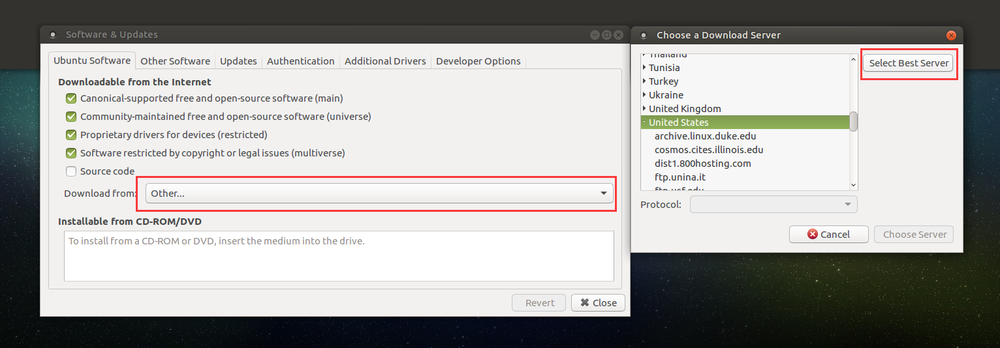

### 2. 更新系统
```
sudo apt-get update

sudo apt-get upgrade

# 安装一些通用开发包
sudo apt-get install -y python build-essential curl automake autoconf libtool

# 安装git
sudo apt-get install -y git

# 安装svn
sudo apt-get install subvison
```

### 3.多安装些浏览器
```
sudo apt-get install chromium-browser   ##Chronium浏览器

# 下载最新稳定版的Google
wget https://dl.google.com/linux/direct/google-chrome-stable_current_amd64.deb
```


### 4.nodejs环境安装

### 5.go环境安装
